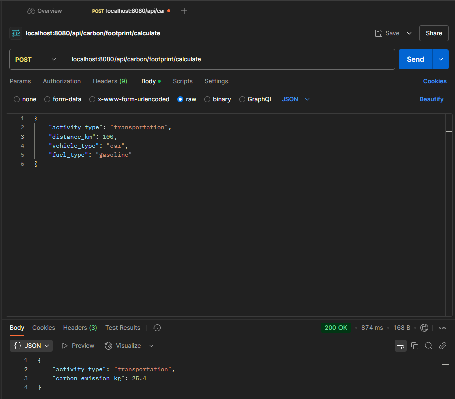

### Step 1 : Create table "emission_factors"
#### Run `3/create_emission_factors.sql` to create table

### Step 2: Replace with your database config
#### Replace with your database config
```
var dsn = "host= user= password= dbname= port= sslmode="
```

### Step 3: Run Project
```bash
go run main.go
```

### Step 4: Call API Endpoint: localhost:8080/api/carbon/footprint/calculate
```cgo
curl --location 'localhost:8080/api/carbon/footprint/calculate' \
--header 'Content-Type: application/json' \
--data '{
    "activity_type": "transportation",
    "distance_km": 100,
    "vehicle_type": "car",
    "fuel_type": "gasoline"
}'
```
#### Result : 
```cgo
{"activity_type":"transportation","carbon_emission_kg":25.4}
```
